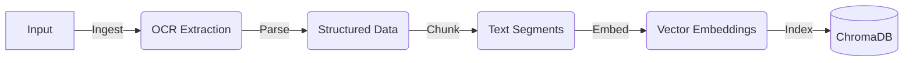

# 🤖 RAG Voice Chatbot 


# Phase 1: Data Ingestion Pipeline

## 📖 Project Overview

This repository contains the **Data Ingestion and Indexing Pipeline** for the **RAG Voice Chatbot** project.

The goal of Phase 1 is to build a robust system that transforms unstructured data (images, documents) into a structured, searchable knowledge base. It automates the process of extracting text from images, generating semantic embeddings, and indexing them into a local Vector Database (ChromaDB) for future retrieval.

### 🚀 Key Features
* **Batch Ingestion:** Automatically scans directories for image files (`.png`, `.jpg`).
* **OCR Integration:** Uses **Tesseract OCR** to extract raw text from images.
* **Smart Parsing:** Wraps extracted text with metadata (Source, Timestamp, File Type).
* **Semantic Chunking:** Splits large documents into context-aware chunks (Sliding Window approach).
* **Vector Embeddings:** Converts text into 384-dimensional vectors using **HuggingFace** (`all-MiniLM-L6-v2`).
* **Local Vector Store:** Persists data in **ChromaDB** for efficient similarity search.

---

## ⚙️ Architecture

The pipeline follows a sequential **ETL (Extract, Transform, Load)** workflow:



##  Tech Stack and Installation Guide

This section covers the required technologies and the setup instructions.


## 🛠️ Tech Stack

* **Language:** Python 3.11+
* **Package Manager:** `uv` (Fast Rust-based pip alternative)
* **Core Libraries:**
    * `pytesseract` & `Pillow` (Image Processing)
    * `sentence-transformers` (Embeddings)
    * `chromadb` (Vector Database)
    * `pandas` & `numpy` (Data Handling)


## 📥 Installation

### 1. Prerequisites
* **Python 3.10+** installed.
* **Tesseract OCR** installed on your system.
    * *Windows:* [Download Installer](https://github.com/UB-Mannheim/tesseract/wiki)
    * *Linux:* `sudo apt install tesseract-ocr`
    * *macOS:* `brew install tesseract`

### 2. Clone the Repository

```bash
git clone [https://github.com/yourusername/rag-voice-chatbot.git](https://github.com/yourusername/rag-voice-chatbot.git)
cd rag-voice-chatbot

```
### 3. Install Dependencies (using uv)
This project uses **uv** for fast and strict dependency management. (Alternatively, can use pip)

**Install uv (Windows):**
```powershell
powershell -ExecutionPolicy ByPass -c "irm [https://astral.sh/uv/install.ps1](https://astral.sh/uv/install.ps1) | iex"
```
```bash
# Create virtual environment
uv venv

# Activate it (Windows)
.venv\Scripts\activate

# Install dependencies
uv pip install -r requirements.txt
```

---
## Usage, Project Structure, and Roadmap

This is the final block, wrapping up the practical details and future plans.


## 🏃‍♂️ Usage

1.  **Prepare Data:** Place your `.png` or `.jpg` images inside the `data/images/` folder.
2.  **Run the Pipeline:**
    ```bash
    python main.py
    ```
3.  **Output:**
    * The script will print the processing status for each file.
    * A new folder `chroma_db/` will be created (this contains your Vector Database).
    * Any text extracted will be permanently stored and indexed.

---
